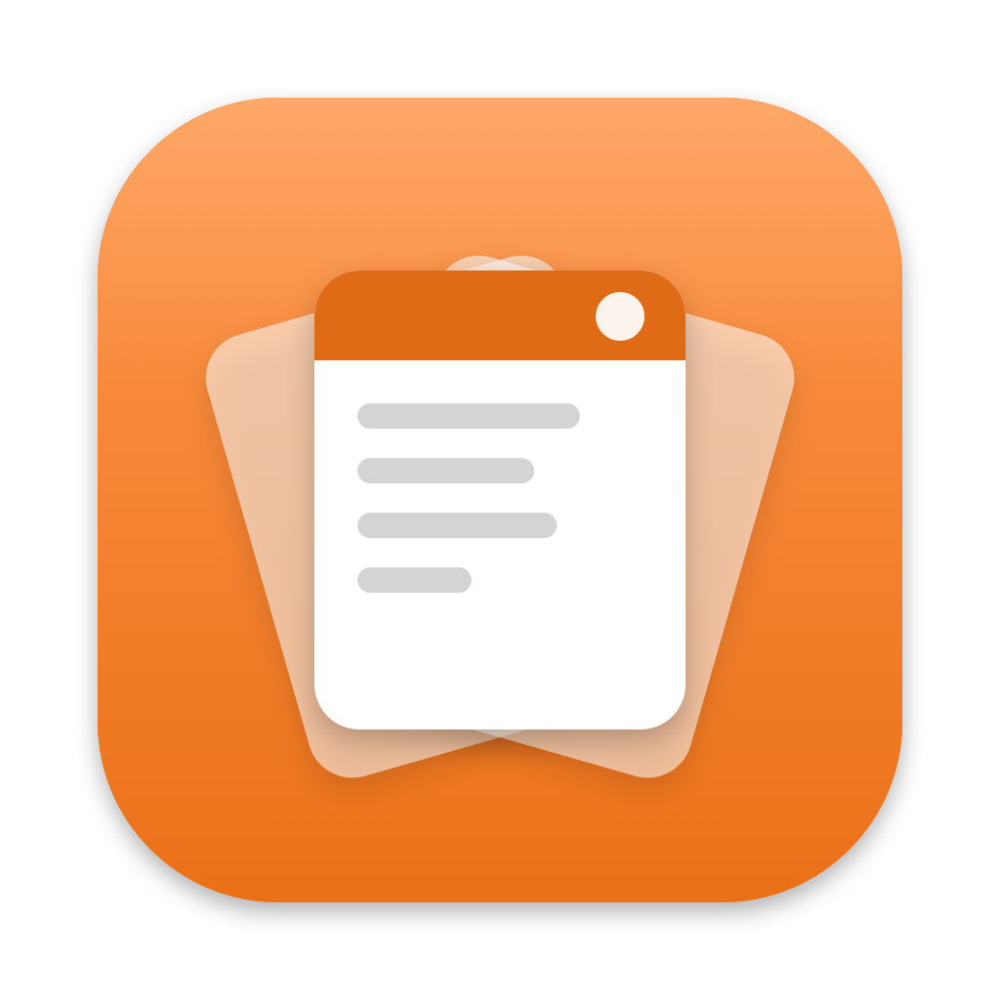

<p align="center"></p>

# Clippa

*Read in English: [README.md](README.md)*

Un gestore degli appunti per macOS. Clippa conserva tutto quello che copi (testi, link, immagini, file e colori) per il tempo che scegli tu, e te lo riporta con **⇧⌘V**. Gratuita e open source, fatta per funzionare come [Paste](https://pasteapp.io), con i tuoi dati sui tuoi Mac.

Clippa è un progetto indipendente, non collegato a Paste né ai suoi autori.

## Cosa fa

* **Cronologia degli appunti** in una barra in fondo allo schermo, dal più recente. Ogni scheda mostra un'anteprima, l'app da cui viene (con il suo colore) e quando l'hai copiata.
* **Conserva la cronologia per il tempo che vuoi**: 1 giorno, 1 settimana, 1 mese, 1 anno o per sempre. **Ogni elemento può avere anche una sua regola**: eliminarlo dopo un'ora, un giorno, una settimana, un mese, un anno, oppure conservarlo per sempre.
* **Ricerca** mentre scrivi, nei testi, nei titoli dei link, nei nomi delle app e nel **testo dentro le immagini** (riconosciuto sul tuo Mac). Filtri per tipo, app, data e Mac.
* **Bacheche**: raccolte con nome e colore per quello che riusi. Gli elementi in bacheca non scadono mai.
* **Incolla direttamente nell'app che stai usando**, oppure come testo semplice, o più elementi insieme. **Incolla rapido** con ⌘1…⌘9.
* **Incolla in sequenza** (⇧⌘C): copi più cose, poi le incolli una alla volta, in ordine.
* **Modifica e rinomina** gli elementi prima di incollarli; ruota le immagini; copia il testo di un'immagine.
* **Suggerimenti** (✦): gli elementi adatti all'app in cui stai incollando, ordinati sul tuo Mac, con Apple Intelligence quando c'è.
* **Strumenti AI**: Claude, Codex, Cursor e gli altri client MCP possono cercare nella cronologia, se lo permetti.
* **Sincronizzazione tra Mac** con iCloud Drive (o qualsiasi cartella sincronizzata), anche in modalità "solo bacheche".
* **Suoni** quando copi e quando Clippa incolla; puoi scegliere i tuoi file audio nelle Impostazioni.
* **Privacy**: le password e le app che scegli non vengono mai salvate. Puoi sospendere Clippa quando vuoi.

L'app è in inglese, con una traduzione italiana che macOS sceglie da solo quando il Mac è impostato in italiano.

## Installazione

Servono macOS 14 Sonoma o successivi e gli strumenti per sviluppatori di Apple. Se non li hai, installali gratis con `xcode-select --install`.

Tre strade, scegline una. Tutte compilano Clippa sul tuo Mac, quindi non serve una firma Apple e non compare nessun avviso di sicurezza.

### 1. Un solo comando

```sh
curl -fsSL https://raw.githubusercontent.com/massimodascola/clippa/main/install.sh | sh
```

Scarica il codice, lo compila, copia Clippa in Applicazioni e la avvia. Lo script è [install.sh](install.sh): leggilo prima, se vuoi sapere cosa fa.

### 2. Homebrew

```sh
brew install massimodascola/tap/clippa
clippa-install
```

Homebrew compila Clippa ma da solo non può copiare app in Applicazioni: lo fa il comando `clippa-install`.

### 3. Dal codice sorgente

```sh
git clone https://github.com/massimodascola/clippa.git
cd clippa
sh build.sh --install
```

Senza `--install`, `build.sh` crea soltanto `build/Clippa.app`.

### Primo avvio: due permessi

* **Leggere gli appunti.** Da macOS 15.4 il sistema chiede il permesso prima che un'app legga gli appunti da sola. La prima volta che copi qualcosa scegli **Consenti sempre** (oppure impostalo in Impostazioni di Sistema → Privacy e sicurezza → Incolla da altre app).
* **Incollare nelle tue app.** Per incollare direttamente nell'app che stai usando, consenti Clippa in Impostazioni di Sistema → Privacy e sicurezza → Accessibilità (su macOS 27 si chiama *Controllo del dispositivo e accesso ai dati*). Clippa la usa solo per premere ⌘V (e per osservare ⌘V mentre Incolla in sequenza è attivo). Senza, Clippa copia l'elemento e premi tu ⌘V.

Se usi anche Paste, chiudilo oppure cambia una delle due scorciatoie ⇧⌘V: può averla una sola app.

### Aggiornare

Aggiorna nello stesso modo in cui hai installato. Cronologia, bacheche e impostazioni restano.

* **Un solo comando**: rilancialo.
* **Homebrew**: `brew update && brew upgrade massimodascola/tap/clippa && clippa-install` (scrivi il nome della formula: `brew upgrade` da solo aggiorna tutti i pacchetti Homebrew del Mac).
* **Dal codice sorgente**, nella cartella `clippa`: `git pull && sh build.sh --install`.

Dopo un aggiornamento macOS può smettere di riconoscere il permesso Accessibilità (vedi [Tenere i permessi tra un aggiornamento e l'altro](#tenere-i-permessi-tra-un-aggiornamento-e-laltro)): togli Clippa dall'elenco Accessibilità con il pulsante −, poi consentila di nuovo.

### Disinstallare

Spegni "Apri Clippa al login" nelle Impostazioni, esci da Clippa dall'icona nella barra dei menu, poi sposta `/Applications/Clippa.app` nel Cestino. I dati sono in `~/Library/Application Support/Clippa`: cancella anche quella cartella per togliere tutto. Se hai usato Homebrew, lancia anche `brew uninstall clippa`.

## Come si usa

Premi **⇧⌘V** (oppure fai clic sull'icona nella barra dei menu e poi Apri Clippa, o apri Clippa da Applicazioni o Spotlight). Inizia a scrivere per cercare.

| Tasti | Azione |
|---|---|
| ← → | Elemento precedente o successivo (con ⇧ estendi la selezione) |
| ↩ / ⇧↩ | Incolla / incolla come testo semplice |
| ⌘1 … ⌘9 | Incolla rapido l'elemento con quel numero (⇧⌘ per il testo semplice) |
| Spazio | Anteprima |
| ⌘C | Copia negli appunti senza incollare |
| ⌘E / ⌘R | Modifica / rinomina |
| ⌘N / ⇧⌘N | Nuovo elemento di testo / nuova bacheca |
| ⌘F, o scrivi e basta | Cerca; Tab o ↩ passano ai risultati |
| ⌘← ⌘→ | Bacheca precedente o successiva |
| ⌘G | Mostra un risultato della ricerca nel suo elenco |
| ⌫ / ⌘Z | Elimina / annulla |
| ⌘O | Apri un link, o mostra un file nel Finder |
| ⌘T | Sospendi Clippa per un'ora |
| ⇧⌘C | Incolla in sequenza (funziona da qualsiasi app) |
| Esc | Cancella la ricerca, poi chiude |

Fai doppio clic su una scheda per incollarla, trascinala in qualsiasi app o su una bacheca. Con il clic destro trovi tutto il resto, compresi **Conserva** (la regola di conservazione del singolo elemento) e **Fissa**. Trascina il bordo superiore della barra per alzarla o abbassarla; una barra bassa passa a una vista compatta.

Le scorciatoie ⇧⌘V e ⇧⌘C, e i tasti modificatori di Incolla rapido e del testo semplice, si cambiano in Impostazioni → Scorciatoie.

### Per quanto tempo restano gli elementi

Impostazioni → Generali → Conserva la cronologia vale per tutti gli elementi che non sono in una bacheca (1 mese di predefinito). Con clic destro → **Conserva** dai a un elemento una regola sua: da quel momento segue quella, che sia in bacheca o no. Un elemento in bacheca che esce dalla cronologia per età resta nella sua bacheca. Se abbassi l'impostazione, Clippa chiede conferma prima di eliminare gli elementi più vecchi. Cancella cronologia toglie tutta la cronologia tranne gli elementi in bacheca e quelli da conservare per sempre.

### Suggerimenti

Premi ✦ nella barra. Clippa guarda l'app che stavi usando (nome, titolo della finestra e testo intorno al cursore, letti con il permesso Accessibilità) e ordina i tuoi elementi: cosa avevi già incollato in quell'app, che tipo di elementi riceve di solito, quanto ogni elemento è vicino a quello che stai scrivendo e quanto è recente. Da macOS 26, con Apple Intelligence attiva, il modello sul Mac riordina i candidati migliori. Volendo (Impostazioni → Intelligenza) può leggere anche il testo visibile in quella finestra, cosa che richiede il permesso Registrazione schermo. Niente viene salvato e niente esce dal Mac. Le app ignorate e i campi password non vengono mai letti.

### Strumenti AI (MCP)

Attiva Impostazioni → Intelligenza → "Permetti agli strumenti AI di cercare in Clippa". Clippa risponde allora al [Model Context Protocol](https://modelcontextprotocol.io) con `clippa-mcp`, un piccolo programma dentro l'app che gli strumenti AI avviano sul tuo Mac.

Claude Code:

```sh
claude mcp add --scope user clippa -- /Applications/Clippa.app/Contents/MacOS/clippa-mcp
```

Claude Desktop, Cursor, VS Code e gli altri client: aggiungi questo alla loro configurazione `mcpServers`.

```json
"clippa": {
  "command": "/Applications/Clippa.app/Contents/MacOS/clippa-mcp"
}
```

Strumenti: `search_clipboard`, `get_item`, `list_pinboards`; con "Permetti loro di aggiungere e fissare elementi" anche `add_item`, `pin_item` e `copy_to_clipboard`. Tra Clippa e lo strumento non passa niente in rete, ma lo strumento stesso può mandare quello che legge al suo fornitore del modello: controlla le impostazioni di privacy degli strumenti che colleghi.

### Sincronizzazione tra Mac

Impostazioni → Sincronizzazione, su ogni Mac:

* **Disattivata** (predefinita): niente esce da questo Mac.
* **Solo bacheche**: si sincronizzano solo le bacheche e gli elementi fissati, nei due sensi. Adatta a un Mac di lavoro collegato a un account iCloud personale.
* **Cronologia e bacheche**: tutto.

Clippa sincronizza attraverso una cartella, `iCloud Drive/Clippa` di predefinito (va bene qualsiasi cartella sincronizzata, per esempio Dropbox: scegli la stessa su ogni Mac). Ogni Mac scrive solo i suoi file e legge quelli degli altri, così iCloud non deve mai unire un file; quando due Mac cambiano lo stesso elemento, vince la modifica più recente. Clippa non usa CloudKit, che richiede un account sviluppatore Apple a pagamento. I dati in quella cartella sono protetti come il resto del tuo iCloud Drive (cifrati end-to-end solo con la Protezione avanzata dei dati attiva). Non si sincronizzano gli elementi oltre i 25 MB né i file a cui puntano i riferimenti a file copiati. Ogni Mac applica la sua regola di conservazione.

## Privacy

* Tutto resta in `~/Library/Application Support/Clippa` sul tuo Mac (un database SQLite e una cartella di file), salvo che tu attivi la sincronizzazione.
* Di predefinito Clippa ignora i contenuti segnati come riservati o temporanei (i gestori di password segnano così le password) e tutto quello che copi nei gestori di password più diffusi. Aggiungi altre app in Impostazioni → Privacy. Alcune estensioni dei browser copiano le password in un modo che nessuna app può riconoscere: se ti preoccupa, ignora anche il browser.
* Le anteprime dei link scaricano titolo e immagine dei link web copiati; si spengono in Impostazioni → Privacy.
* Sospendi Clippa dalla barra dei menu (15 minuti, 1 ora, 8 ore o finché non riprendi) o con ⌘T nella barra.

## Tenere i permessi tra un aggiornamento e l'altro

macOS lega il permesso Accessibilità alla firma esatta dell'app. Clippa viene firmata *ad hoc* dal Mac che la compila, quindi ogni nuova versione sembra un'app nuova e il permesso va concesso di nuovo. Per evitarlo, firma le tue build con un certificato stabile. Basta un Apple ID gratuito: in Xcode → Impostazioni → Account aggiungi il tuo Apple ID, poi Gestisci certificati → + → Apple Development. Poi compila con:

```sh
CLIPPA_SIGN_IDENTITY="Apple Development" sh build.sh --install
```

## Compatibilità

* **macOS 27**: sviluppata su macOS 27.0.1 (MacBook Pro con Apple Silicon, schermo interno ed esterno).
* **Da macOS 14 a 26**: dovrebbe funzionare (il codice controlla ogni API più recente), ma **non è provata**. Se la provi, apri una issue, anche solo per dire che funziona.
* Apple Silicon e Intel: `build.sh` compila per il Mac su cui gira.
* **iPhone e iPad**: non disponibili. Il codice di archivio, ricerca, conservazione e sincronizzazione (`ClippaCore`) usa solo Foundation e SQLite, quindi in futuro ci si può costruire sopra un'app iOS.

## Limiti noti

* Niente bacheche condivise: condividerle con altre persone richiederebbe un server o CloudKit.
* I suggerimenti sono ordinati da Apple Intelligence solo sui Mac dove è disponibile e attiva; altrimenti Clippa usa il suo ordinamento sul Mac.
* I file copiati sono conservati come riferimenti: se il file viene spostato o cancellato, la scheda resta ma il file non c'è più.
* Non c'è un download già pronto: l'app viene firmata ad hoc dal Mac che la compila.

## Come funziona

* `Sources/ClippaCore`: il database (SQLite con un indice di testo a trigrammi, così "bot" trova "robot"), i file salvati una volta sola con il loro SHA-256, la conservazione e la sincronizzazione via cartella. Solo Foundation e SQLite.
* `Sources/Clippa`: l'app macOS. Gli appunti vengono controllati alcune volte al secondo (macOS non avvisa quando cambiano; il controllo non legge nessun contenuto finché qualcosa non cambia). La barra è un pannello che prende la tastiera senza attivare Clippa, così l'app che stavi usando resta davanti e riceve l'incolla.
* `Sources/ClippaMCP` e `Sources/clippa-mcp`: il server MCP, JSON-RPC su stdin e stdout.
* `Sources/ClippaPasteboard`: rimette negli appunti gli elementi salvati, condiviso tra l'app e il server MCP.

Per chi sviluppa:

```sh
swift test                         # test di archivio, ricerca, conservazione, sincronizzazione e MCP
swift tools/check-strings.swift    # ogni testo dell'interfaccia ha la sua traduzione italiana
sh tools/make-icon.sh              # ridisegna l'icona da tools/draw-icon.swift
```

## Licenza

[MIT](LICENSE).
